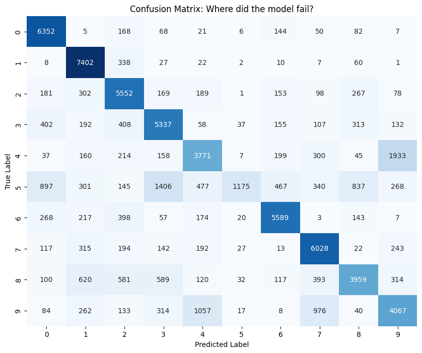
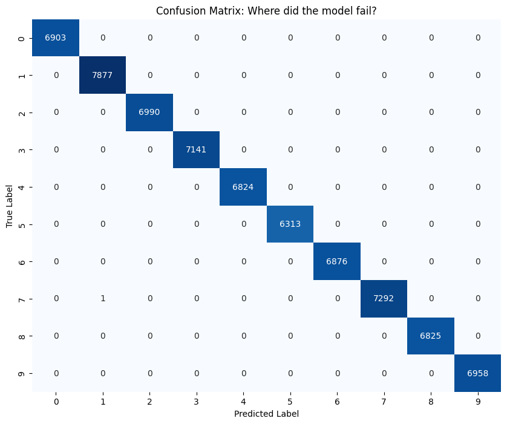
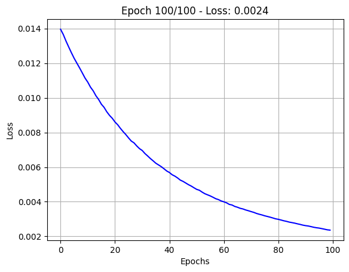

# MLP on MNIST from Scratch (NumPy)

A three-layer neural network for handwritten-digit classification written with nothing but NumPy: He initialisation, ReLU, a numerically stable softmax, cross-entropy loss and hand-derived backpropagation. It is trained two ways, full-batch gradient descent and mini-batch SGD, so the two can be compared.

## Why from scratch

Frameworks like PyTorch hide the gradient computation behind autograd. Here every step is written out as matrix operations: the forward pass, the loss, each layer's gradient and the parameter update. That makes the mechanics visible, including the practical details that keep training stable (the scale of the initial weights, the max-shift inside softmax, clipping inside the log).

## Architecture

| Layer | Shape of `W` | Units | Activation | Parameters |
|---|---|---:|---|---:|
| Input | – | 784 (28×28 pixels, flattened) | – | – |
| Hidden 1 | `(256, 784)` | 256 | ReLU | 200,960 |
| Hidden 2 | `(256, 256)` | 256 | ReLU | 65,792 |
| Output | `(10, 256)` | 10 | Softmax | 2,570 |
| **Total** | | | | **269,322** |

- **Data:** `mnist_784` from OpenML via `sklearn.datasets.fetch_openml` (70,000 images).
- **Preprocessing:** pixels divided by 255 to scale them to [0, 1]; labels one-hot encoded with `LabelBinarizer`.
- **Layout:** samples are stored as columns, so `X` has shape `(784, m)` and `Y` has shape `(10, m)`.

## The math

**He initialisation.** Weights are scaled for ReLU layers; biases start at zero.

$$W^{[l]} \sim \mathcal{N}\left(0, \frac{2}{n_{l-1}}\right), \qquad b^{[l]} = 0$$

**Forward pass**

$$Z^{[1]} = W^{[1]} X + b^{[1]}, \qquad A^{[1]} = \max(0, Z^{[1]})$$

$$Z^{[2]} = W^{[2]} A^{[1]} + b^{[2]}, \qquad A^{[2]} = \max(0, Z^{[2]})$$

$$Z^{[3]} = W^{[3]} A^{[2]} + b^{[3]}, \qquad \hat{Y} = A^{[3]} = \mathrm{softmax}(Z^{[3]})$$

Softmax subtracts the column maximum before exponentiating, so large logits cannot overflow:

$$\mathrm{softmax}(z)_k = \frac{e^{z_k - \max_j z_j}}{\sum_{j} e^{z_j - \max_j z_j}}$$

**Loss: categorical cross-entropy.** Predictions are clipped to $[10^{-15}, 1 - 10^{-15}]$ before the log.

$$\mathcal{L} = -\frac{1}{m} \sum_{i=1}^{m} \sum_{k=1}^{10} Y_{ki} \log \hat{Y}_{ki}$$

**Backpropagation.** Softmax combined with cross-entropy gives a simple output gradient, and ReLU passes gradient only where its input was positive:

$$dZ^{[3]} = A^{[3]} - Y$$

$$dZ^{[l]} = \left( W^{[l+1]\top} dZ^{[l+1]} \right) \odot \mathbf{1}\left[ Z^{[l]} > 0 \right], \qquad l = 2, 1$$

$$dW^{[l]} = \frac{1}{m} dZ^{[l]} A^{[l-1]\top}, \qquad db^{[l]} = \frac{1}{m} \sum_{i=1}^{m} dZ^{[l]}_{:,i}, \qquad A^{[0]} = X$$

**Update: plain gradient descent** with learning rate $\eta$.

$$W^{[l]} \leftarrow W^{[l]} - \eta \, dW^{[l]}, \qquad b^{[l]} \leftarrow b^{[l]} - \eta \, db^{[l]}$$

## Training runs

| | Full-batch gradient descent | Mini-batch SGD |
|---|---|---|
| Epochs | 100 | 100 |
| Learning rate | 0.01 | 0.01 |
| Batch size | all 70,000 images (1 update per epoch) | 64, reshuffled every epoch (1,094 updates per epoch) |
| Starting weights | fresh He initialisation | continues from the full-batch weights |
| Saved weights | `weights_full_batch.pkl` | `weights_mini_batch.pkl` |

## Results

All figures below come from the notebook's saved outputs. The model is evaluated on the same 70,000 images it was trained on (see [Limitations](#limitations)).

| Run | Loss recorded in the notebook | Confusion matrix on the 70,000 training images |
|---|---|---|
| Full-batch GD | 2.566 at epoch 0, 1.842 at epoch 50 (the last value logged) | Many errors remain: only 1,175 of 6,313 fives are correct, and 1,933 fours are predicted as 9 |
| Mini-batch SGD | 0.0024 average loss in the final epoch | 1 error out of 70,000 (a single 7 predicted as 1) |

The contrast shows how much update frequency matters. With the same learning rate and epoch count, full-batch descent makes 100 weight updates, while mini-batch SGD makes about 109,000.

| Full-batch confusion matrix | Mini-batch confusion matrix |
|---|---|
|  |  |

<details>
<summary>Mini-batch training loss curve</summary>



</details>

## Limitations

- **There is no held-out test set.** Both runs train and evaluate on all 70,000 images, so the results measure how well the model fits the training data, not how well it generalises. A near-perfect training confusion matrix is unsurprising for a 269k-parameter network, and it says nothing about accuracy on unseen digits. The obvious next step is to use the standard 60,000 / 10,000 train/test split.
- **The mini-batch run is not independent.** It starts from the full-batch weights instead of a fresh initialisation. The notebook's execution counter also jumps from 19 to 25 before that cell, and the first mini-batch epoch already averages a loss of 0.014. Together these suggest the cell was run more than once, so the saved mini-batch weights may reflect more than 100 epochs of training.
- **Full-batch loss is only logged every 50 epochs**, so the loss after the final (100th) epoch is not recorded.

## How to run

The notebook was developed in Google Colab. It runs on CPU and needs no GPU.

```bash
git clone https://github.com/AryadipMridha/Multi-Layer-Perceptron-on-MNIST.git
cd Multi-Layer-Perceptron-on-MNIST
pip install -r requirements.txt jupyter
jupyter notebook mlp_mnist_numpy.ipynb
```

The first run downloads MNIST from OpenML through `fetch_openml`.

## Loading the saved weights

Each `.pkl` file holds a dict of NumPy arrays: `W1 (256, 784)`, `b1 (256, 1)`, `W2 (256, 256)`, `b2 (256, 1)`, `W3 (10, 256)`, `b3 (10, 1)`.

```python
import pickle
import numpy as np
from sklearn.datasets import fetch_openml

with open("weights_mini_batch.pkl", "rb") as f:  # or weights_full_batch.pkl
    params = pickle.load(f)

def predict(X, params):
    """X: (n_samples, 784) array of pixels scaled to [0, 1]. Returns predicted digits."""
    A1 = np.maximum(0, params["W1"] @ X.T + params["b1"])
    A2 = np.maximum(0, params["W2"] @ A1 + params["b2"])
    Z3 = params["W3"] @ A2 + params["b3"]
    return Z3.argmax(axis=0)  # argmax of the logits equals argmax of the softmax

X, y = fetch_openml("mnist_784", version=1, return_X_y=True, as_frame=False)
print(predict(X[:10] / 255.0, params), y[:10])
```

Only unpickle files from a source you trust.

## Repository layout

| File | Contents |
|---|---|
| `mlp_mnist_numpy.ipynb` | End-to-end notebook: data loading, EDA, model, both training runs, evaluation, write-up |
| `weights_full_batch.pkl` | Parameters after full-batch training |
| `weights_mini_batch.pkl` | Parameters after mini-batch training |
| `assets/` | Figures exported from the notebook's saved outputs |
| `requirements.txt` | Python dependencies |
